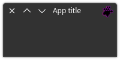

# Quick start

We will start by downloading the project and configuring the environment.

## Download and configure

Download and enter the project directory:

```commandline
git clone https://github.com/reticulardev/pysidex.git && cd pysidex/
```

Configure your virtual environment:

```commandline
python3 -m venv venv && . venv/bin/activate
```

Update pip and install dependencies:

```commandline
python -m pip install --upgrade pip && python -m pip install -r requirements.txt
```

Run the example to see it working:

```commandline
python src/demo.py
```


## The imports

In your code file, import the `sys` lib, import `PySide` to have access to all 
widgets, import `PySideX` to build the CSD window and finally configure the 
`snake_case` feature. As already mentioned, the project uses the `snake_case` 
feature to obtain idiomatic code.

```python
import sys
from PySide6 import QtCore, QtGui, QtWidgets
from PySideX import QtWidgetsX
from __feature__ import snake_case
```

## The minimal example

A **highly discouraged** minimal example would be:

```python
app = QtWidgets.QApplication(sys.argv)
window = QtWidgetsX.QApplicationWindow()
window.show()
sys.exit(app.exec())
```

This would give you a little window that can be resized in any direction. 
However, there is no button to close the application and, depending on your 
platform, it may be difficult to close the application:


A better minimal example in this situation includes adding a headerbar to 
access the window control buttons:

```python
class Window(QtWidgetsX.QApplicationWindow):
    def __init__(self):
        super().__init__()

        self.main_layout = QtWidgets.QVBoxLayout()
        self.central_widget().set_layout(self.main_layout)

        self.main_layout.set_contents_margins(0, 0, 0, 0)
        self.main_layout.set_alignment(QtCore.Qt.AlignTop)

        self.headerbar = QtWidgetsX.HeaderBar(self)
        self.main_layout.add_widget(self.headerbar)


app = QtWidgets.QApplication(sys.argv)
window = Window()
window.show()
sys.exit(app.exec())
```

Note that a central widget with appropriate settings already exists. As it is 
already accessed directly, there is no need to create one.

```python
self.central_widget().set_layout(self.main_layout)
```

Also note that the headerbar widget is independent, meaning you can place it 
wherever you want, which is why we aligned it at the top.

```python
self.main_layout.set_contents_margins(0, 0, 0, 0)
self.main_layout.set_alignment(QtCore.Qt.AlignTop)
```

This is the result:


## A more complete minimal example

In this example, we will add the 'os' library to add an icon with a dynamic 
path. The icon, once configured in the window, will be automatically recognized 
by the header bar.

The title is not automatically recognized by the header bar as in the case of 
the icon, because not in all use cases a window needs to have the title 
displayed. In our case, if we want to see the window title, we need to manually 
redirect it to the header bar.

```python
#!/usr/bin/env python3
import os
import sys

from PySide6 import QtCore, QtGui, QtWidgets
from PySideX import QtWidgetsX
from __feature__ import snake_case

SRC_DIR = os.path.dirname(os.path.abspath(__file__))
sys.path.append(SRC_DIR)


class Window(QtWidgetsX.QApplicationWindow):

    def __init__(self, *args, **kwargs) -> None:
        super().__init__(*args, **kwargs)

        # Window icon
        icon_path = os.path.join(SRC_DIR, 'icon.svg')
        window_icon = QtGui.QIcon(QtGui.QPixmap(icon_path))
        self.set_window_icon(window_icon)

        # Layout
        self.main_layout = QtWidgets.QVBoxLayout()
        self.main_layout.set_contents_margins(0, 0, 0, 0)
        self.main_layout.set_alignment(QtCore.Qt.AlignTop)
        self.central_widget().set_layout(self.main_layout)

        # Headerbar
        self.headerbar = QtWidgetsX.HeaderBar(self)
        self.main_layout.add_widget(self.headerbar)

        # Window title
        self.set_window_title('App title')
        self.headerbar.set_text(self.window_title())


if __name__ == '__main__':
    app = QtWidgets.QApplication(sys.argv)
    window = Window()
    window.show()
    sys.exit(app.exec())
```

This is the result:


