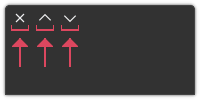

# QControlButton 

Inherits from [QToolButton](https://doc.qt.io/qtforpython-6/PySide6/QtWidgets/QToolButton.html)



## Overview

A window control button. It could be the close, maximize or minimize button.

## Class signature

<pre><small>QControlButton(main_window: QtWidgets, button_id: int) -> None
</small></pre>

### Parameters

  - **main_window**: Type `QApplicationWindow` (QtWidgets.QMainWindow)

    Just pass `self` which indicates the top-level window instance:

    
    self.control_button = QControlButton(self, 2)
    
  - **button_id**: Type `int`

    It can be the number 0, 1, 2 or 3. Each number represents a type of button: 
    `0` is the **minimize** button, `1` is the **maximize** button, `2` is the 
    **close** button and `3` is **window icon**.

## Signals

**enter_event_signal** = QtCore.Signal(object)

**leave_event_signal** = QtCore.Signal(object)

## Changes

Methods `enter_event` and `leave_vent` have been rewritten, so they are not 
currently accessible. So consider using specific event methods like 
`event_filter`.

## Example

```python
self.control_button = QControlButton(self, 2)
self.layout.add_widget(self.control_button)
```