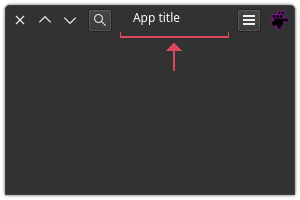

# QWindowMoveArea 

Inherits from [QFrame](https://doc.qt.io/qtforpython-6/PySide6/QtWidgets/QFrame.html)



## Overview

The area where you click and drag to move the window.

## Class signature

<pre><small>QWindowMoveArea(main_window: QApplicationWindow[QtWidgets, QMainWindow])</small></pre>

### Parameters

  - **main_window**: Type `QApplicationWindow` (QtWidgets.QMainWindow)

    Just pass `self` which indicates the top-level window instance:

    
    self.move_area = QHeaderBar(self)

## Methods

Only new ones. See the
[**QFrame** documentation](https://doc.qt.io/qtforpython-6/PySide6/QtWidgets/QFrame.html) 
for more.

- [set_enable](#set_enable)

### set_enable

Signature: `set_enable(enable: bool) -> None`

Parameter `enable`: `bool`

Enable or disable the window moving area. The area does not disappear, it just 
does not respond to clicking and dragging the mouse cursor.

---

## Signals

**mouse_press_event_signal** = QtCore.Signal(object)

**mouse_double_click_event_signal** = QtCore.Signal(object)

## Changes

Methods `mouse_press_event` and `mouse_double_click_event` have been rewritten, 
so use the `mouse_press_event_signal` and 
`mouse_double_click_event_signal` signals, or consider using event-specific 
methods such as `event_filter`.

## Example

```python
self.move_area = QHeaderBar(self)
self.layout.add_widget(self.move_area)
```
