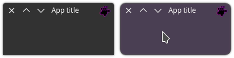

# Styling

The `setObjectName` method does not work for the `QApplicationWindow` nor for 
its *central widget*. To change the **QSS** style you need to use the base name.

```python
self.set_style_sheet(
    'QApplicationWindow {'
    '   background-color: rgba(65, 50, 75, 0.8);'
    '   border-radius: 10px;'
    '   border: 1px solid #555;}')
```

The remaining widgets remain unchanged. See the PySide 
[documentation](https://doc.qt.io/qtforpython-6/tutorials/basictutorial/widgetstyling.html) 
for more.

## Example

```python
#!/usr/bin/env python3
import os
import sys

from PySide6 import QtCore, QtGui, QtWidgets
from PySideX import QtWidgetsX
from __feature__ import snake_case

SRC_DIR = os.path.dirname(os.path.abspath(__file__))
sys.path.append(SRC_DIR)


class Window(QtWidgetsX.QApplicationWindow):

    def __init__(self, *args, **kwargs) -> None:
        super().__init__(*args, **kwargs)

        # Window icon
        icon_path = os.path.join(SRC_DIR, 'icon.svg')
        window_icon = QtGui.QIcon(QtGui.QPixmap(icon_path))
        self.set_window_icon(window_icon)

        # Layout
        self.main_layout = QtWidgets.QVBoxLayout()
        self.main_layout.set_contents_margins(0, 0, 0, 0)
        self.main_layout.set_alignment(QtCore.Qt.AlignTop)
        self.central_widget().set_layout(self.main_layout)

        # Headerbar
        self.headerbar = QtWidgetsX.HeaderBar(self)
        self.main_layout.add_widget(self.headerbar)

        # Window title
        self.set_window_title('App title')
        self.headerbar.set_text(self.window_title())

    def enter_event(self, event: QtGui.QEnterEvent) -> None:
        self.set_attribute(QtCore.Qt.WA_TranslucentBackground)
        self.set_style_sheet(
            'QApplicationWindow {'
            '   background-color: rgba(65, 50, 75, 0.8);'
            '   border-radius: 10px;'
            '   border: 1px solid #555;}')

    def leave_event(self, event: QtGui.QEnterEvent) -> None:
        self.reset_style()


if __name__ == '__main__':
    app = QtWidgets.QApplication(sys.argv)
    window = Window()
    window.show()
    sys.exit(app.exec())
```

This is the result:


